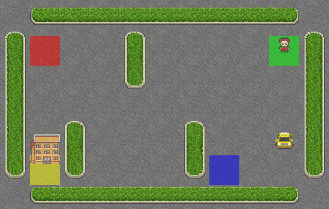

# Q-Learning
# Q-Learning for Taxi-v3 Environment

This project implements a Q-learning algorithm to train an agent in the `Taxi-v3` environment from Gymnasium. The agent learns to navigate a taxi to pick up and drop off passengers, and its behavior is visualized as a GIF.

## Features
- **Q-Learning**: Trains an agent using an epsilon-greedy strategy to balance exploration and exploitation.
- **Environment**: Uses `Taxi-v3`, a discrete grid-world where the taxi navigates to pick up and drop off passengers.
- **Visualization**: Saves and displays the agent's test episode as a GIF (`taxi_agent_behavior.gif`).
- **Reproducibility**: Seeds the environment and random number generators for consistent results.

## Requirements
- Python 3.8+
- Libraries:
  - `gymnasium[toy-text]` (includes `pygame` for rendering)
  - `numpy`
  - `imageio`
  - `ipython` (for Jupyter notebook GIF display)

Install dependencies:
```bash
pip install gymnasium[toy-text] numpy imageio ipython
```

## How to Run
1. **Clone or Save the Code**:
   - Save the provided Python script as `taxi_q_learning.py` or use it in a Jupyter notebook.
2. **Run the Script**:
   - In a terminal:
     ```bash
     python taxi_q_learning.py
     ```
   - In a Jupyter notebook, copy the code into a cell and execute it.
3. **Output**:
   - The script trains the agent for 2000 episodes.
   - A GIF (`taxi_agent_behavior.gif`) is generated in the working directory, showing the agent's test episode.
   - In a Jupyter notebook, the GIF is displayed automatically.
   ```markdown
   
## Notes
- **Performance**: The agent may require tuning (e.g., increase episodes to 5000 or adjust `epsilon_decay`) for better performance.
- **Visualization**: The GIF shows up to 100 steps of the test episode. For real-time rendering, change `render_mode` to `"human"` (not suitable for GIF creation).
- **Troubleshooting**:
  - If `pygame` errors occur, ensure `gymnasium[toy-text]` is installed.
  - If the GIF doesn't display in Jupyter, open `taxi_agent_behavior.gif` manually.
